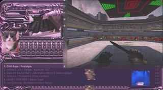

# winamp2-on-obs
Create a Winamp 2 Browser Source on OBS 

If anyone ends up using this, I'd love if you showed me what you did :)

## Demo (click)

## Instructions
1. Download `winamp2-on-obs.zip` from [releases](https://github.com/mattyHerzig/winamp2-on-obs/releases)
1. Unzip it (right-click, "Extract All..." > "Extract")
    - If you just want to copy the OBS scene I used in the [Demo](#demo-click) and go from there, import the `winamp2onobs.json` scene collection on OBS. That will, however, require you to update all of the Local file directories by coping the file as its path, the detail of which is seen below. Also, it requires [OBS ShaderFilter Plus](https://obsproject.com/forum/resources/obs-shaderfilter-plus.929/) for those which are a "User-definer shader"
1. On OBS, add a "Browser" source and name it "Webamp"
    * Enable the "Local file" checkbox, and set the Local file textbox to the directory of `index.html` located in the unzipped file. You can copy the path to this file on Windows by Shift + Right-Clicking it, and selecting "Copy as path". You will need to do this with other Local files you use, if you plan to do so
    * Set the Width to 640, and the Height to 360
    * Enable the "Control audio via OBS" checkbox
    * Once done, select OK
1. Under the Audio Mixer, click the three dots. Set the Webamp's Audio Monitoring appropiately, e.g. I use Desktop (Audio) so I set it to Monitor Only (mute output) to prevent an echo
- Whenever the Webamp Browser Source is refreshed (or just created), you need to select the Webamp Browser Source and click "Interact". From here, drag the top left part of the Webamp to the top left of the window, and drag the bottom right part of the Webamp to the bottom right of the window 
    - Through the interact screen is how you can play songs, enable the loop, change the volume, etc., just like you would through Winamp 2 normally
- To add tracks or change the skin, right-click `index.html` and select "Open with" > "Notepad" (After, you can update the Webamp within OBS by selecting the Webamp Browser Source, and clicking "Refresh")
    - Change the tracklist by modifying, or creating more, of the track templates. A track requires the artist name, the title, and the name of the file as the url. For the url to work as simply the name of the file, it must be located in the same file directory as `index.html` from the unzipped file. You can delete the default ones if you want.
    - Change the skin by modifying the skin url (You can get a new skin by downloading one from the [Winamp Skin Museum](https://skins.webamp.org/), and clicking \[<u>Download</u>\] at the bottom of the screen. After, copy the path just as you do for a track)
- Filters
    - I highly recommend using additional OBS filters from [OBS ShaderFilter Plus](https://obsproject.com/forum/resources/obs-shaderfilter-plus.929/)
    - On the Scene, I used Brightness and Sharpen from OBS, and `bloom.shader`, `pixelation.shader`, and `VHS.shader` from OBS ShaderFilter Plus
    - On Sources e.g. Media Sources or Game Capture, I used Color Correction from OBS and `drunk.shader` from OBS ShaderFilter Plus. I also used Image Mask/Blend with either `feathered corners (for small sources).png` or `feathered corners (for big sources).png` depending on how big I was gonna make it ([tutorial](https://www.youtube.com/watch?v=hzWwGN6ndYU)). If you're going to feather the corners, you have to crop it through the filters with Crop/Pad, rather than just holding holding Alt on the preview and dragging.
    - If you'd like to see the exact settings I used for each filter, import the `winamp2onobs.json` scene collection on OBS 

## Credit
- Inspiration for this project came from [this TikTok](https://www.tiktok.com/@carpetedkitchn/video/7179409845878230318) by [@carpetedkitchn](https://www.tiktok.com/@carpetedkitchn)
- Webamp (what's used to create the Winamp 2 Browser Source) is from [this GitHub repo](https://github.com/captbaritone/webamp) by [captbaritone](https://github.com/captbaritone)
- The [specific purple skin I used on Webamp](https://skins.webamp.org/skin/3b3b8b07fb7d268f6092d4321f0a9b9c/Necromech.wsz/) was created by [Peacemaker](www.peacemaker.tk)
- The images used for the feathered edges came from [Infinite Quality on YouTube](https://www.youtube.com/watch?v=hzWwGN6ndYU)
- Additional OBS filters, e.g. `VHS.shader` or `drunk.shader`, came from [OBS ShaderFilter Plus](https://obsproject.com/forum/resources/obs-shaderfilter-plus.929/). [Here](https://www.youtube.com/watch?v=qHUfQ37E_rc) is the tutorial I used
- Uploaded to obsproject.com [here](https://obsproject.com/forum/resources/winamp-2.1762/)
